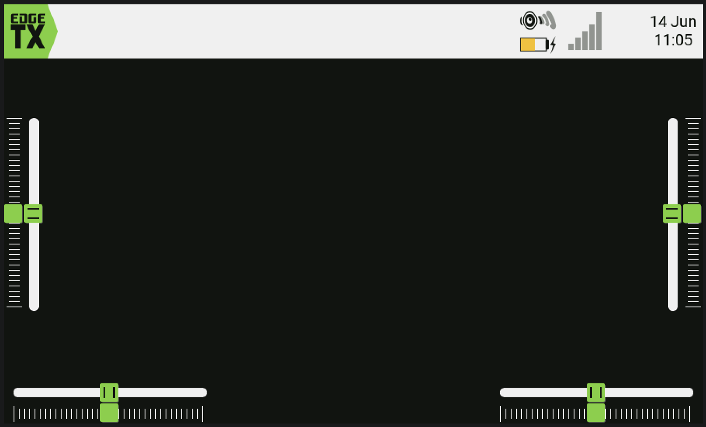
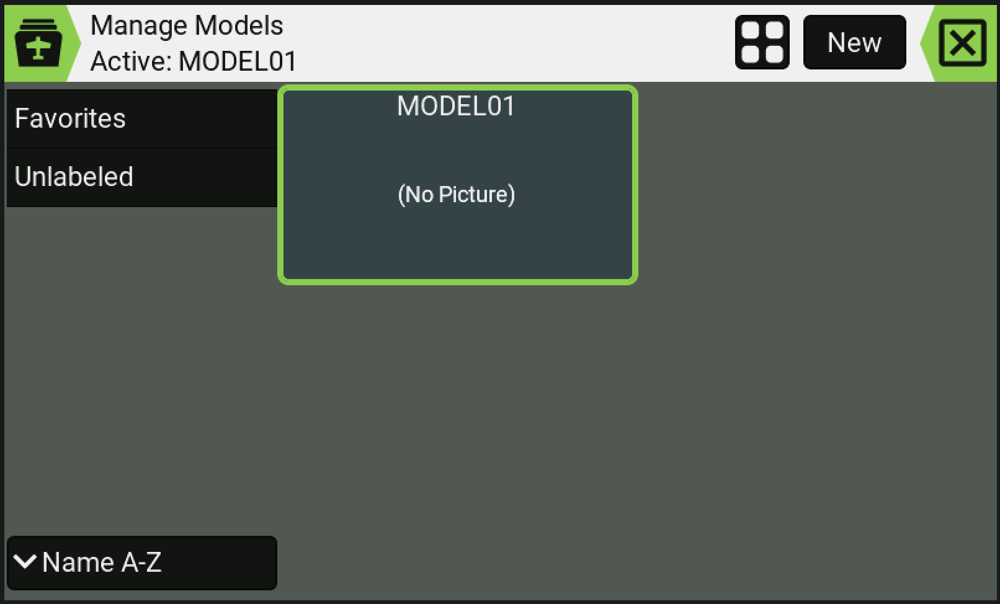
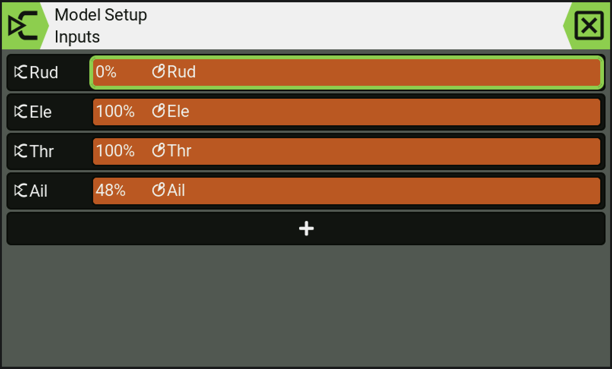
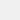

# Acid Dark — EdgeTX Theme

A dark EdgeTX theme with an acid lime accent (`0x7CD230`). Built for color radios.

## Palette

Each variable maps to specific UI elements in EdgeTX (per the official
[theme structure reference](https://github.com/EdgeTX/themes/blob/main/structure.md)):

| Role | Color | Swatch | Used for |
|------|-------|--------|----------|
| PRIMARY1 | `0xF0F0F0` |  | Label text and button text (not focused). |
| PRIMARY2 | `0x121412` |  | ETX logo icon; top-bar icons, text and tab names; bottom-bar text; editable-field background, edited-value text and focused button text; popup field background; trim and slider knobs. |
| PRIMARY3 | `0x969696` |  | Scroll marker and the inactive part of top-bar icons. |
| SECONDARY1 | `0xF0F0F0` |  | Top-bar and bottom-bar background; trim/slider paths and shadows; slider-knob shadow. |
| SECONDARY2 | `0x0C0E0C` |  | Label background and button background. |
| SECONDARY3 | `0x545854` |  | Main screen background and popup background. |
| FOCUS | `0x7CD230` |  | ETX logo background; selected top-bar icon background; focused label and editable-field backgrounds; trim and slider knobs. |
| EDIT | `0x7CD230` |  | Editable-field background while a value is being edited. |
| ACTIVE | `0x37474F` |  | Active button background and editable-field background for an active variable (e.g. switches on, checked boxes). |
| WARNING | `0xFFB400` |  | Warning label text. |
| DISABLED | `0x5A5A5A` |  | Disabled UI elements throughout the interface. |

## Install

1. Copy the `src/THEMES/Acid_Dark` folder to the `/THEMES` directory on your
   radio's SD card.
2. On the radio, go to **Radio Setup → Themes** and select **Acid Dark**.

## Backgrounds

The `background_<WxH>.png` files (320x240, 320x480, 480x272, 480x320, 800x480)
are solid fills in the dark background color `0x121412` (RGB 18, 20, 18),
matching `PRIMARY2`. Replace them with your own dark artwork if you want
something behind the menus.
